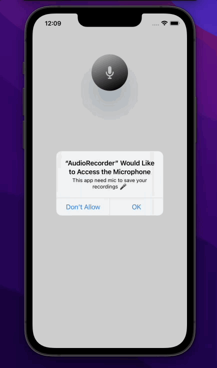

# AudioRecorder 🎤
An app that allows users to record and play sounds.  
In this project, I have focused mainly on AVFoundation and making UI only programmatically.  
The app saves recording on local storage using FileManager and USerDefaults.  

## Demo of an app

  

However, gif doesn't support sounds so I encurage everybody to try this app on their device 🥰.

   
Made with ♥️ in Swift.
